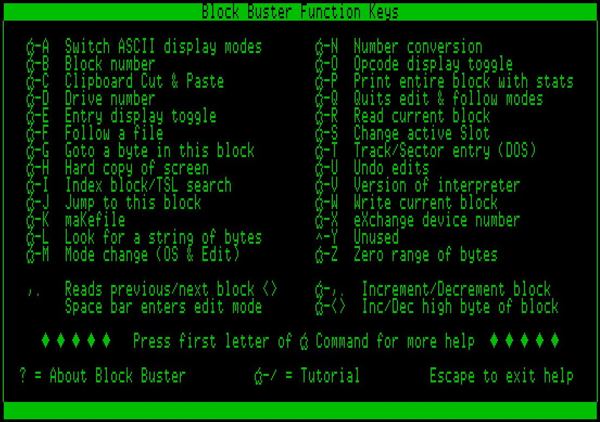
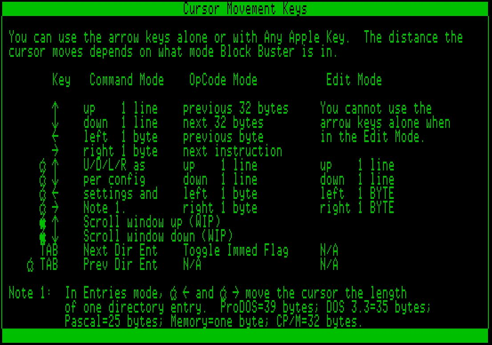

# Online Help

Note: This content is pretty much verbatim from the help included with Block Buster.  

## Block Buster Function Keys




## Cursor Movement Keys




## Additional Features

- Control-P Toggles the Write Protect Flag. The Write Protect feature does NOT disable Writing to a maKefile. 
- **:green_apple:-8** (\*) Enters the Monitor (Press Control-Y to return to Block Buster). 
- **:green_apple:-N** While entering a block or byte, will prompt for a number. You can enter the number in decimal, hexadecimal, or binary notation. See **:green_apple:-N** for additional help.

## Block Buster General Help

- To select from a list of options, use either the left and right arrows to highlight the option and press RETURN. Alternatively, pressing the first letter of the option will select it immediately. In the example below:


  pressing a 'T' or 'F' will select 'To Clipboard' and 'From Clipboard' respectively.

- Online help is available for almost every action and function. If Block Buster should beep, immediately pressing **:green_apple:-?** may give some insight as to why the beep occurred. Any and all suggestion pertaining to the online help would be appreciated.

  When a help screen is active, you can use the Up and Down arrows in conjunction with an Apple key to scan through all available online help.


# Editing Keys

While editing, all alphanumeric keys are used to enter the data. To move the cursor, use the arrows along with Any Apple key to move up, down, left or right.

Most of Block Buster's functions are disabled during editing. Only the following keys are valid:

**:green_apple:-Arrow Keys** - Cursor movement keys

**:green_apple:-M** Toggles the edit mode between high/low ascii, and hex data. 

**:green_apple:-Q** Quits the edit mode.

# Function Keys

## Change ASCII display mode (:green_apple:-A)

This mode changes the way the lower (ASCII) screen displays characters. If you have an enhanced //e, then this toggles between normal, inverse, and mousetext. Otherwise, it toggles between normal and inverse characters.

The 'A' Indicator in the lower right corner shows which character set is being displayed: Normal, Inverse, or MouseText.


## Enter new Block number (:green_apple:-B)

You will be prompted to enter a new block number. This works for the ProDOS, Pascal, Memory and CP/M system modes. See **:green_apple:-T** for changing DOS 3.3 sectors.

Valid block ranges for Disk \]\['s are as follows:

```
ProDOS & Pascal - $0 - $117 
CP/M            - $0 -  $7F 
Memory          - Dependent on system memory
```

For disks other than Disk \]\['s, there will also be an upper range for block numbers. See the volume directory entry for the size of the disk you are currently using. The absolute maximums are given in the table below.

```
                      Valid ranges    Byte Number

ProDOS/Pascal Blocks  $0000 - $FFFF     $000 -$1FF 
CP/M Big Block         $000 -  $FFF     $000 -$3FF 
Memory Page           $0000 - $3F00     $000 - $FF 
DOS 3.3                 N/A             $000 - $FF
```

Pressing the ESCAPE key while entering a number will cancel the operation and restore the original number.

## Incrementing & Decrementing Current Block

The comma/&lt; and period/&gt; keys are used to increment and decrement the current block.

- , (<)   Reads previous block into buffer
- . (>)   Reads next block into buffer
- **:green_apple:-,** (&lt;) Decrements current block *without* reading 
- **:green_apple:-.** (&gt;) Increments current block *without* reading 
- **:green_apple:-&lt;** Decrements High byte of block *without* reading 
- **:green_apple:-&gt;** Increments Lo byte of block *without* reading

## Clipboard Cut and Paste (:green_apple:-C)

Block Buster contains a 512-byte clipboard. This feature allows you to cut portions of a block and paste it back into another block, or to a different area of the current block. 

Selecting **:green_apple:-C** brings up the prompt:
```
Copy: To Clipboard   From Clipboard
```

The 'To Clipboard' option copies or moves data from the edit buffer and places it on the Clipboard. Pasting, the 'From Clipboard' option, copies the data from the clipboard and inserts or overwrites the edit buffer beginning at the cursor position.

See the help screens for 'To Clipboard' and 'From Clipboard' for more help on Cutting and Pasting.

### Copy to Clipboard

Use the cursor keys to select a chunk of data to copy. After pressing RETURN, you will get the following prompt:
```
Copy: Cut   Kopy
```
Selecting 'Kopy' will copy the data to the clipboard, where a 'Cut' will delete the data from the current block after copying it to the clipboard.

### Highlighting a Range of Bytes

Use the arrow keys to select the range of bytes. Press RETURN when you are finished. If you wish to cancel the operation, hit the ESCAPE key.

### Copy from Clipboard

The cursor must be in the starting location prior to the **:green_apple:-K** command. Selecting the 'From Clipboard' option will bring you to the prompt:
```
Copy: Replace   Insert
```
Inserting the data will insert the clipboard data at the current cursor position. Any overflow from the end of the block is discarded.

Replacing will overwrite the existing data.

Note: Any Copy operation can be undone with the **:green_apple:-U** command.

Pasting from the clipboard will not touch the clipboard data, so it can be copied multiple times.

### Clipboard Help

You cannot **:green_apple:-C**opy to the clipboard when **:green_apple:-O**pcodes are active. Turn off the Opcode display to use the clipboard.

The clipboard size is limited to 512 bytes.

## Toggle Drive Number (:green_apple:-D)

Toggles the current device between Drive 1 and Drive 2.

**:green_apple:-D** is not valid while **:green_apple:-F**ollowing a file.

## Toggle Entry Description Display (:green_apple:-E)

Toggles the display of the directory Entry descriptions. The entry descriptions are operating system dependent (System mode - **:green_apple:-M**). Entry descriptions show the file and directory descriptive entries along with their values within the directory blocks of the current disk.

The Entry indicator (E) is on when entries are active.

## Follow a File (:green_apple:-F)

Once you have selected **:green_apple:-F**, you will be prompted for a file name. Enter a valid ProDOS file name. This name must be a fully qualified ProDOS pathname. Pressing Escape will erase the name. After accepting the filename by pressing RETURN, the first block of the file will be read into the buffer. You are limited to the current file when using the NextBlock/PreviousBlock keys.

Use **:green_apple:-Q** to quit following the file. You will not be able to exit Block Buster until you stop following the file.

Note that this function currently only follows ProDOS files. You cannot change System modes (**:green_apple:-M**) while following a file.

### While Following a File...

While following a file:

- You cannot follow another file. Only one file may be open at a time.

- The **:green_apple:-I**ndex Block search is deactivated. **:green_apple:-Q**uit following the file to an index block search.

- The **:green_apple:-S**lot and **:green_apple:-D**rive functions are disabled since Block Buster is using the pathname.

- You cannot quit Block Buster. You must **:green_apple:-Q**uit following the file before quitting Block Buster.

## Goto Byte (:green_apple:-G)

**:green_apple:-G** moves the cursor to a specific byte within the block.

After selecting **:green_apple:-G**, the cursor moves to the byte location field. Enter the byte you wish to move to and press RETURN. If you press ESCAPE, there will be no change in the cursor location.

If the byte is outside the current block (greater than $1FF\[511\] for a ProDOS or PASCAL block), then the cursor moves to the end of the block.

## Dump the Screen to the Printer (:green_apple:-H)

This prints a copy of the screen to the printer.

See **:green_apple:-P** for instruction on how to change the printer initialization string and the printer slot.

**:green_apple:-\\** can be used to redraw the screen if the display has garbage left over from the dump.

## Search for Index Blocks (:green_apple:-I)

Searches the current disk for a valid index block (ProDOS System mode), or Track/Sector list (DOS 3.3 System mode).

The algorithm is not 100% reliable. ProDOS blocks which have less than 256 bytes of data may be flagged as an Index Block. One clue to identifying an Index Block is that the byte values will usually be sequential. This logic begins to fail on highly fragmented disks.

As the block is searched, every time a block entry appears out-of-sequence, a 'Confidence' counter is incremented. A lower 'Confidence' value is better (i.e. more confident). Configuration Byte $AC sets a threshold for determining if a block is an Index Block or not. If more than 'Threshold' blocks occur out-of-sequence, then the block is assumed to NOT be an Index Block.

**:green_apple:-I** only works in the ProDOS or DOS 3.3 modes. If you are in another system mode, you will get an error message.

## Jump To (:green_apple:-J)

Reads a specific block, or positions the cursor to a specific byte within a file. After selecting **:green_apple:-J**, you will get the following prompt:

```
    Jump to:  Block   Data Block   File Position   End of File
```

- **Block** - Uses the cursor byte and the next byte as the block number to jump to.
- **Data Block** -  Uses the cursor byte and the byte at cursor+$100 as the block number to jump to. Use this when the buffer holds a ProDOS index block.
- **File Position** - Enter the absolute file position you want to move the cursor to. The value can be either in decimal or hexadecimal (See the help for :green_apple:-N for help on entering decimal and hex numbers). Block Buster will position the cursor to the specified byte.
- **End of File** - The cursor is moved to the last byte of the file. This option is only valid when following a file.


### Jump Options

To **:green_apple:-J**ump to **Data Block**, the cursor must be in the first half of the block (bytes 0-255), and in ProDOS or DOS 3.3 mode.

To **:green_apple:-J**ump to a **File Position** or **End of File**, you must currently be following a ProDOS file.

## Make a file (:green_apple:-K)

Makefile allows you to create a file from the buffer or parts of the buffer. When making a file, the status line shows the name of the file, current position within the file, and the file's length.

- **Ctrl-W** *Writes* a chunk 
    - **All** - Writes entire block to the file 
    - **Some** - Lets you select how much of the block to write 
    - **To End** - Writes everything from the cursor to the end of the buffer
- **Ctrl-B** - *Back* - Repositions the file mark from the last write operation. This will "back up" the file position for up to the last three writes. Note that this does NOT undo the write itself, it only changes the file position.
- **Ctrl-C** - *Closes* the makefile.
- **Ctrl-Q** - *Quits* - cancels the makefile after asking if you really want to
- **Ctrl-E** - *EOF* - Writes from the beginning of the block to the cursor position.

## Look for a String (:green_apple:-L)

Enter the string to search for.

To search for:

- **Lo ASCII text** ($00-$80) - precede the string with a single(') quote
- **Hi Ascii text** ($80-$FF) - precede the string with a double(") quote
- **Hex bytes** - enter each byte separated by a space.  A leading dollar sign ($) is not needed.  The hexadecimal digits can be either upper or lowercase.

To repeat the last search, select **:green_apple:-L** and press RETURN to accept the last string.

## System Block Read Mode (:green_apple:-M)

Sets the System mode for reading and writing blocks.

Block Buster can read and write ProDOS, Pascal, DOS 3.3, and CP/M diskettes, as well as any memory page including GS extended memory and RamWorks banks.

Type the first letter of the option, or highlight the entry with the arrow keys and press RETURN.

## Number Conversion (:green_apple:N)

You can convert numbers between binary, hexadecimal, or decimal.

To convert from decimal, simply enter the number and press RETURN.

To convert from hex or binary, enter the number preceded by a dollar sign ($) for hex, or a percent sign (%) for binary. Then press RETURN.

The range is limited to a three-byte value, so the maximum numbers are 
- $FFFFFF (hex)
- 16,777,215 (decimal)
- 11111111 11111111 1111111 (binary)

## Opcode Display (:green_apple:-O)

Selecting **:green_apple:-O** toggles between the hex display and the opcode display. Eight instructions are shown starting with the byte at the current cursor position.

The opcodes displayed include 65802/816 operations. In the lower left corner of the screen are the Index Register (X) and Memory (M) Select Indicators. Since Block Buster has no way of knowing the state of the processor at execution time, these Indicators must be set by the user.

While the opcodes are being displayed, the TAB key toggles the X and M Indicators.

The X and M bits are emulation flags and determine the sizes of the index registers and memory word size respectively. If the bit is clear (zero), then access utilizes the full 16-bit register. Eight-bit access (6502 emulation) takes place when the bit is set (one).

Note that the 16-bit opcodes are only valid on a //gs or a //e with a 65802/816 installed.

## Print Block (:green_apple:-P)

**:green_apple:-P** will print the current block along with statistics about the block or file.

\**:green_apple:-\** can be used to redraw the screen if **:green_apple:-P** ruins the screen layout.

The default printer slot is Slot 1. You can change this permanently by running the Block Buster Installation program, or temporarily by setting the System mode (**:green_apple:-M**) to Memory, and then reading in page eight from main memory ($0008). Change byte $00 to the slot number of your printer.

The printer initialization string is also located on memory page eight. Byte $801 is the length of the initialization string, and the next 15 bytes are the actual string.

After you have made the changes, **:green_apple:-W**rite the block back to memory.

## Quit Editing or Following a file (:green_apple:-Q)

**:green_apple:-Q** has two meanings. If hit while in the edit mode, **:green_apple:-Q** returns you to the Command mode.

When following a file, **:green_apple:-Q** will close that file and flush any changes to the disk. Note that the edit mode **:green_apple:-Q** has priority over quitting a file.

## Read Block (:green_apple:-R)

This reads the current block, sector, BigBlock or memory page into the buffer.

## Slot Change (:green_apple:-S)

**:green_apple:-S** allows you to change the slot of the current device.

Valid device numbers are 1-7.

You cannot change the active slot when you are **:green_apple:-F**ollowing a file.

## New Track/Sector (:green_apple:-T)

This is the DOS 3.3 equivalent of **:green_apple:-B** used for the other modes. After selecting **:green_apple:-T**, enter the new track and hit RETURN. Hitting the ESCAPE key will cancel the operation.

Next, enter the new sector and hit RETURN. Hitting ESCAPE here will bring the cursor back to the track entry.

## Undo Edits (:green_apple:-U)

Whenever you read in a new block, Block Buster also copies the data to its Undo buffer.

If you want to recover the original data after you have edited the block, hit **:green_apple:-U**, and the original data will be copied back into the buffer.

You can Undo the edits as many times as necessary, as long as you don't read in another block. There is only one level of Undo.

## Kernel & Block Buster Version (:green_apple:-V)

Displays the version of Block Buster, the current version of the ProDOS kernel, and the minimum ProDOS version that this kernel is compatible with.

## Write Block (:green_apple:-W)

This writes the buffer to the current block, sector, BigBlock or memory page. Selecting 'Yes' will write the buffer to the currently selected destination, and answering 'No', or pressing the ESCAPE key will cancel the write.

Writing can be enabled/disabled with the Control-P (Write Protect) key. When write protected, the write protect indicator ('WP') is visible on the left side of the screen, about half way down.

Write Protecting is global to Block Buster, and not specific to any particular drive.

## Exchange Parameters (:green_apple:-X)

Block Buster incorporates a method to quickly toggle between two different locations, disks, and operating systems.

Selecting **:green_apple:-X** will switch the current block, system, device and cursor location with the identical settings in a save area. Pressing **:green_apple:-X** again will switch these settings back to their original values.

Note that this does not read in the new block, but only changes the settings. You must explicitly do an **:green_apple:-R** to read in the data.

If you are currently following a file and then select **:green_apple:-X**, the file is switched out, and the Follow Indicator (F) is toggled on to remind you that there is a file open. You must **:green_apple:-X** and then **:green_apple:-Q** to be able to exit Block Buster.

## ? ? ? Why ? ? ? (:green_apple:-Y)

**! ! !  Congratulations ! ! !**  You have discovered **:green_apple:-Y**

Pressing **:green_apple:-Y** doesn't do anything. 

## Zero Buffer (:green_apple:-Z)

**:green_apple:-Z** lets you fill a range of bytes with a particular value. The default value is zero (0), and the default range is from the cursor position to the end of the block.

After selecting **:green_apple:-Z**, you will receive the following prompt:

```
Fill with: Zeros   Value
```

If you select the 'Value' option, the prompt will change to:

```
Fill with: Value:  
```

Enter a single byte number either decimal or hexadecimal (preceded with a $). You will then be asked for a range to fill. Select either 'Range' or 'To End'. If you select 'Range,' then you will be asked for the number of bytes to fill. Again, enter a value in decimal or hexadecimal (preceded by a $).


# Configuring Block Buster

To modify the configuration, use Block Buster to Follow BB.SYSTEM. The Configuration bytes start at Byte $03, and are described on the next Help Screen (**:green_apple:-D**own Arrow).


## Configuration Defaults

Various configuration values are stored in the Block Buster file (BB2.SYSTEM).  To modify the values, **:green_apple:-F**ollow your copy of BB2.SYSTEM and change the appropriate value according to the table below:

```
FilePos   Description 
     $24  Printer Slot 
     $25  Printer Initialization String Size 
 $26-$34  Printer Initialization String (15 bytes) 
     $36  First Flag 
     $37  # of lines to move for :green_apple:-Up/Down 
     $38  # of bytes to move for :green_apple:-Left/Right 
     $39  Debug flag (0=debugging) 
 $3B-$3C  On/Off delay values for flashing cursor 
 $3D-$3F  Buzz 1 Delay Values 
 $40-$42  Buzz 2 Delay Values 
     $43  Help files location (0=boot disk; 1=path; 2=Copy to /RAM)
 $44-$73  Pathname buffer for Index File
 $74-$A3  Pathname buffer for Help File
     $A4  Entry Description Flag (0=off, &gt;0=on) 
     $A5  Default Display (OS) Mode 
     $A7  Immediate Mode Size 
     $A9  ASCII Display Mode (Normal, Inverse, MouseText) 
     $AA  End of Block Action 
     $AB  Write Protect Flag (non-zero = protect) 
     $AC  Index Block Threshold (see **:green_apple:-J)**
```

# Tips and Beeps


## Entering a Filename

This must be a fully qualified pathname. It must begin with a '/' and be less than 64 characters long. The current prefix is displayed. This can be edited or appended to. The following keys can be used while entering a filename:

```
              Left and Right arrows
              RETURN = Accept entry
              DELETE = Same as left arrow 
              ESCAPE = Erases the entry, or, if no entry
                       exists, cancels the operation.
```

## Quitting Block Buster

Before quitting, you must close all Followed files (**:green_apple:-Q**), and/or maKefiles (**Ctrl-C**).

```
    Thanks for using Block Buster!!!
```

## Follow/Make Active

You tried to do one of the following:

- Select **:green_apple:-F**ollow when a Follow was already active
- Select :green_apple:-ma**k**efile when a maKefile was already active

A follow and a make can be active at the same time, but only a single follow and a single makefile are valid.

## Entering Hexadecimal Numbers

You pressed an invalid key while entering a hexadecimal number. Only the numbers 0 through 9 and A through F are valid hex digits. The lettered keys (a-f) may be either upper case or lower case.

## Entering Pathnames

When entering a filename or pathname, only alphanumeric keys, the period, and slash (/) are valid. You can use the arrow keys to move left and right. The first ESCAPE key will erase the entry, and the second will cancel the pending function.

## End of Search

While doing a search, Block Buster reached the end of the file or volume. Reset the block number to a new value and restart the search.

## Invalid Keypress

You pressed an invalid key.

For a list of keys valid in the various modes, press **:green_apple:-?** at any time.

## MLI Error

An unanticipated error has occurred. When you get the message 'MLI Error $xx($mmmm)', there may be a bug in Block Buster. The 'xx' refers to the ProDOS error number, and 'mmmm' indicates the address of the MLI call. Please send me these numbers, along with the steps used to recreate the problem, and I will try to determine why the error occurred.

## ProDOS and DOS 3.3 Notes

- **:green_apple:-B**lock is only for entering memory pages, and for ProDOS, Pascal, and CP/M blocks.

- **:green_apple:-T**rack/sector is only for entering DOS 3.3 track/sector pairs.


