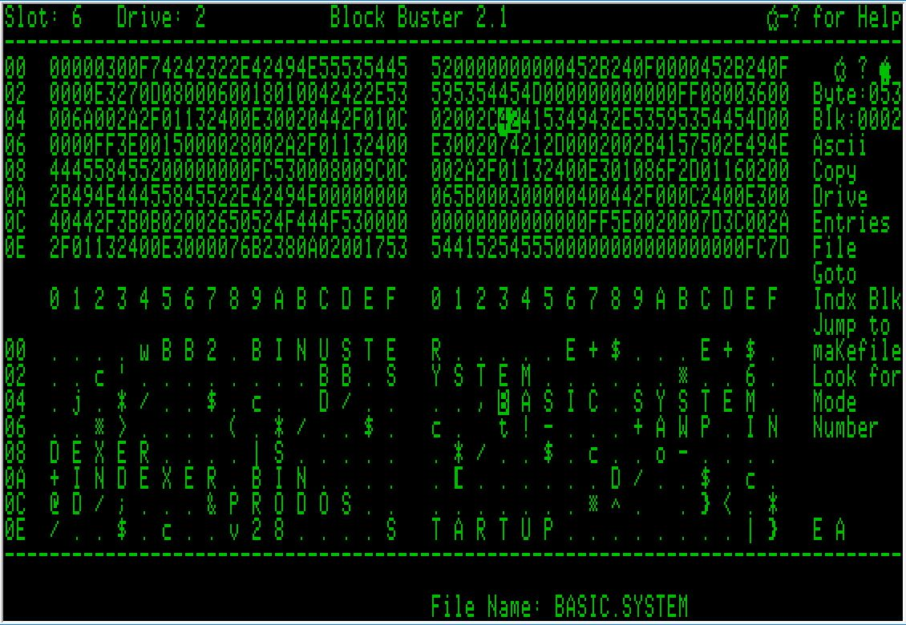

# Block Buster 2.1

Note:  Block Buster is bring replaced byi Block Buster 3.0, and is almost ready for Beta testing.  Stay tuned!

Block Buster is a full-featured disk editor designed to aide you in working with corrupted diskettes and learn the internals of Apple // operating system diskette formats. Block Buster can read ProDOS, DOS 3.3, Apple Pascal, and CP/M formatted disks, as well as system memory.

I wrote Block Buster back in the early 80's, mostly in the margins of high school English and History class notes.  I never released it, but it has saved the day several times over.  This version has slightly more features, much better comments, and very stable.

As with any tool which accesses the disk, you could give yourself a very bad day if not careful.  Use at your own risk; I'm not responsible if something goes wrong.
