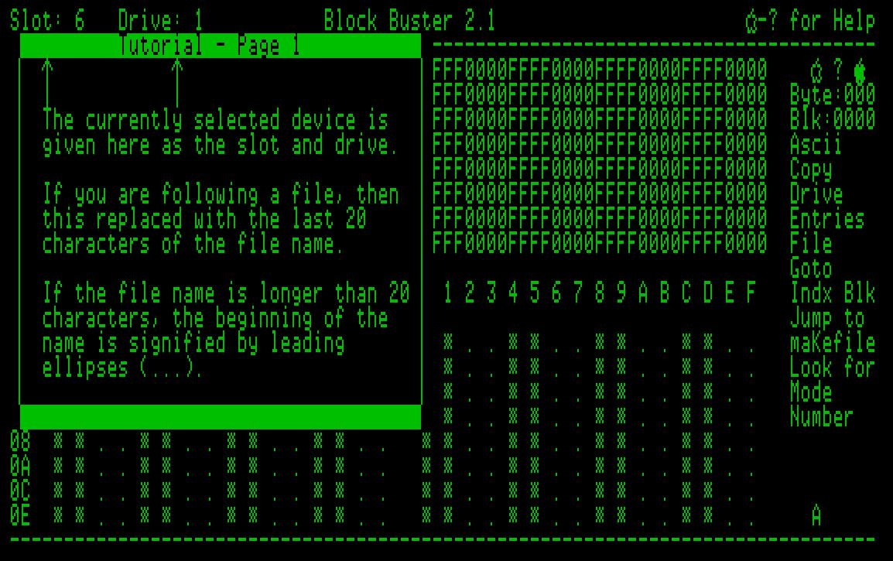
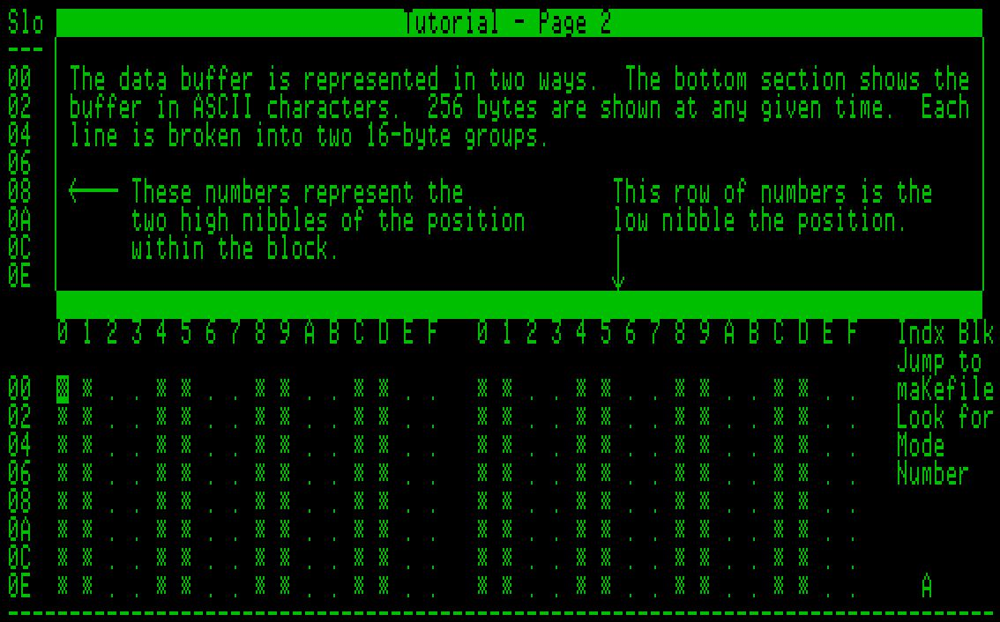
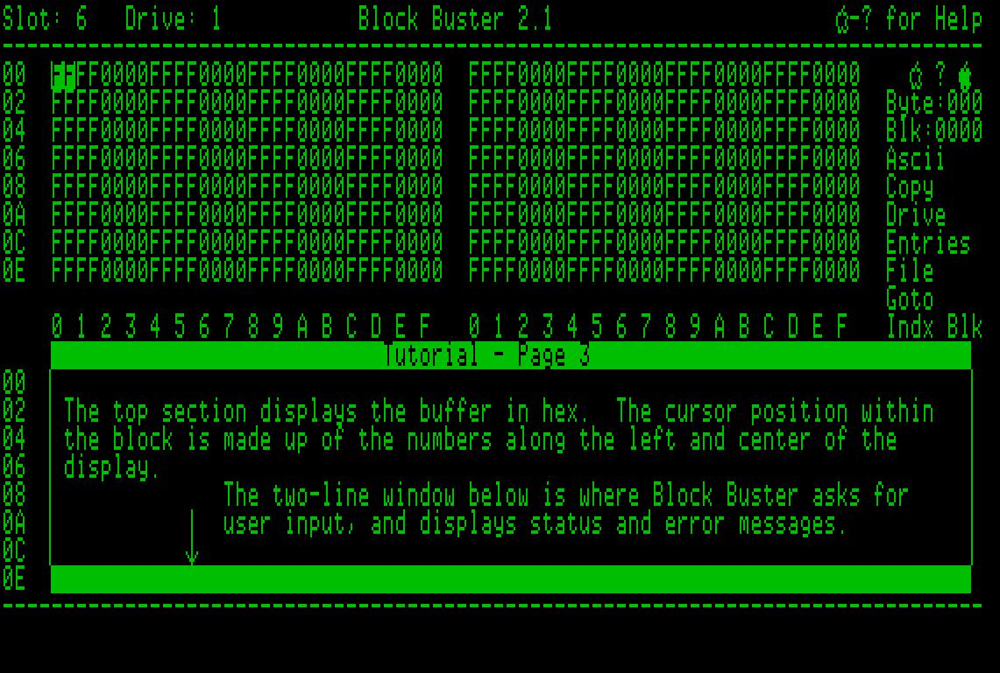
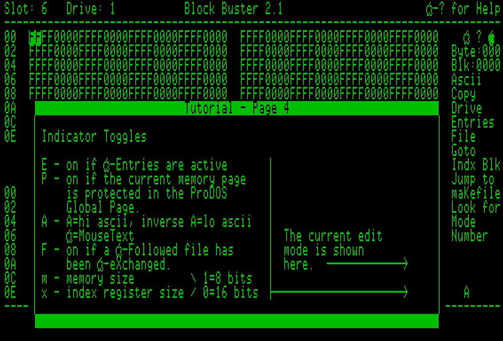
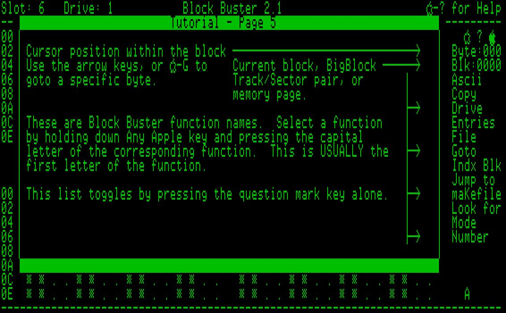
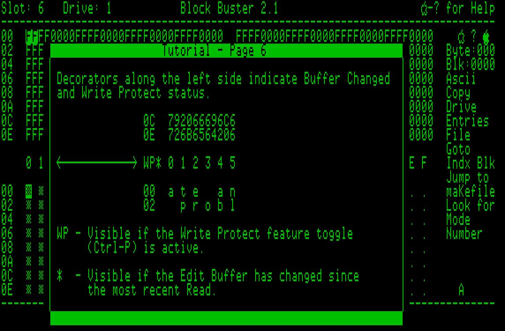

## Block Buster Tutorial

This is a brief tutorial of Block Buster. After this tutorial, you will be ready to explore the many powerful features of Block Buster.

Access the tutorial from within Block Buster by pressing **:green_apple:-/** twice (think **:green_apple:-?** but without the shift key).

Use the up (**:green_apple:-&uarr;**) and down (**:green_apple:-&darr;**) arrows while holding down Any Apple key to navigate through the tutorial.

Press the Escape key at any time to exit the tutorial.

The main screen consists of two regions, one a hexadecimal representation of the block, and the other an ASCII representation.  Each region has eight rows divided into two columns of 16 bytes for a total of 256 bytes visible at any given time.  The 256 byte window is scrollable via the arrow keys.

The screen has holds various data elements and indicators such as Slot/Drive, Block/Track-Sector, and byte position within the block.

As you scroll through the block, the numbers along the left show the high two nibbles of the bytes for that row, while the column number (byte within the row) is shown across the middle of the screen.

Block Buster communicates to the user via the bottom two status rows.  This is where menus and prompting occurs, as well as error messages and Entry values.

The current Edit mode is shown in the lower right corner.  The Edit mode indicator is not shown unless Editing is turned on (Space bar).

Just above the bottom divider line is an array of indicators.  These indicators change based on the mode Block Buster is in.

Along the right side of the screen you have the byte number (position) within the block, as well as the Block (or Track/Sector) number.  

Block Buster functions are listed below the Block number.  Pressing the question mark key will toggle through the subsets of functions (as all cannot fit on the screen at the same time).

The final indicators are in the small area along the left of the screen.  If the Write Protect (:green_apple:**-Ctrl-P**) is toggled on.  If the contents of the buffer has changed since the last disk Read, an asterisk will be shown to alert you of a modified buffer.  The indicator is turned off after a Read or a Write operation.

